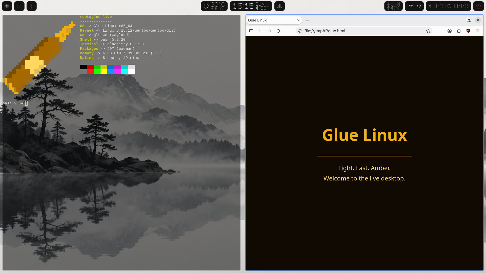

# Glue Linux

A light, Arch-based Linux distribution without systemd, tuned for gaming and
easy enough for someone who has never installed Linux.

> **Beta.** Glue Linux is tested on a small number of machines. Back up your
> data before installing next to another system, and please report problems in
> [Issues](https://github.com/vladbiber/glue-linux/issues) (attach the link
> from `glue-debug --upload`).



- **No systemd:** pick **dinit** (default), **runit** or **OpenRC** at install time.
- **Kernel:** `linux-cachyos` (default) or `linux-zen`. On CPUs with
  x86-64-v3 the kernel and the gaming packages come from CachyOS's v3 builds.
- **Graphical installer:** Calamares with Glue's own pages for the network,
  the desktops, the kernel, the init system and gaming.
- **Seven desktops, install as many as you like:** gluewc + glueqs (default),
  gluewc + Noctalia, nvwm, KDE Plasma, XFCE, GNOME and Cinnamon. The login
  screen lets you pick one each time.
- **Glue Apps:** one store for the system repositories, Flathub, the AUR and
  AppImages, with a system update that keeps going when one package can't.
- **Gaming in one click:** Steam with Proton-CachyOS and GE-Proton, Heroic,
  Lutris, Wine, GameMode, MangoHud, Gamescope, the `scx_lavd` scheduler and
  ananicy-cpp priorities. Graphics drivers are picked for your card.

## Installing

Boot the ISO (Ventoy works). The live desktop opens **Glue Welcome**; press
**Install Glue Linux**. The installer asks, in this order:

1. **Network:** shows whether you are online and opens the Wi-Fi window. The
   install downloads its packages, so it needs a connection.
2. **Location, keyboard, partitions, user.** An existing EFI partition can be
   reused without formatting: when another system already boots with Limine
   from it, Glue adds its entries at the end of that menu and keeps a backup
   of the original `limine.conf`. Other operating systems found on the disks
   get their own entries.
3. **Desktop:** cards with a preview, how light each desktop is and how much
   memory it uses when idle. Pick one or more.
4. **Kernel** and **init system** (the defaults are fine for most people).
5. **Gaming:** yes or no.

The app store, Bluetooth, PipeWire, NetworkManager, zram swap, Wi-Fi
regulatory data and microcode are always installed. SSDs are mounted with
TRIM, everything with `noatime`.

### Graphics on the live system

The live desktop runs gluewc on your graphics card. If the card can't run it
(an unsupported or very old GPU), the installer opens in a simple full-screen
mode instead; the boot menu also has **NVIDIA off** and **safe graphics**
entries. When something goes wrong, `glue-debug --upload` in a terminal
collects the graphics and session logs and gives you a link to share.

Laptops with NVIDIA work both in hybrid mode (Intel or AMD drives the screen)
and with the MUX switched to the NVIDIA card. The installed system gets the
NVIDIA driver for your card's generation and a `prime-run` helper; put
`prime-run %command%` in a Steam game's launch options to run it on the
dedicated GPU of a hybrid laptop.

## After the install

- **Glue Welcome** opens at login (Super+Shift+F1 brings it back): the keys of
  the desktop you are in, an update button, system information and settings.
- **Glue Apps** ([separate repository](https://github.com/vladbiber/glue-apps))
  searches every source at once. *Update all* asks for the password once,
  clears a lock left by a power cut, refreshes the package keys, and if one
  package cannot be upgraded it leaves it for later and updates the rest.
  Flatpak and AUR apps are updated after the system, so a broken AUR recipe
  never blocks system updates.
- **Screen sharing** works on gluewc through the desktop portal (Discord,
  OBS, browsers).
- On the tiling desktops folders open in Files, pictures in Image Viewer,
  videos in Celluloid and PDFs in Papers, even when KDE or Cinnamon are
  installed next to them.

## The [glue] repository

Glue's own packages live in a signed pacman repository,
[glue-repo](https://github.com/vladbiber/glue-repo/releases/tag/x86_64), so
gluewc, glueqs, Glue Apps, the installer and the gaming pieces built without
systemd are updated with the rest of the system. It comes first in
`/etc/pacman.conf`, which keeps a package of the same name from another
repository or the AUR from replacing them. The signing key is in the
`glue-keyring` package.

It also carries a few apps that are not installed by default:

| Package | What it is |
|---|---|
| `ctify` | Lightweight music player (SDL2) |
| `spotc` | Spotify in the terminal, with slowed and reverb playback |
| `creader` | PDF, EPUB and comic reader (SDL2 + MuPDF) |
| `librespot` | Spotify Connect client, used by spotc |

```sh
sudo pacman -S ctify      # or: yay -S ctify
```

## Known limitations

- Secure Boot has to be turned off in the firmware settings.
- The install downloads its packages, so it needs an internet connection.
- Disk encryption (LUKS) is not offered by the installer yet.

## gluewc and glueqs

[gluewc](https://github.com/vladbiber/gluewc) is the default Wayland
compositor: tiling with three layouts (bsp, scroll, drift) on one key, an
overview on a tap of Super, animations and blur.
[glueqs](https://github.com/vladbiber/glueqs) is its bar and shell: launcher,
notifications, network, volume and brightness panels (with sleep mode), media
controls and a settings window for gluewc itself.

## Building the ISO

You need Docker; the build runs in a container, so any host distro works.

```sh
git clone https://github.com/vladbiber/glue-linux.git
cd glue-linux
./build.sh
```

`build.sh` builds the `[glue]` packages from `packages/` and runs `buildiso`
on `iso-profile/glue/`. When a GnuPG home with the signing key exists at
`~/.local/share/glue-signing` (or `GLUE_SIGN_HOME`), the packages and the
database are signed, and `scripts/publish-repo.sh` uploads the repository. The ISO lands in `out/` (about 2.6 GB). Later runs
reuse the package cache; `GLUE_PKGS="gluewc glueqs" ./build.sh` rebuilds only
the packages you name, and `GLUE_REPO_ONLY=1` stops after the repository
(for publishing package updates without a new ISO).

Copy it to a Ventoy stick (`cp out/glue-runit-*.iso /run/media/$USER/Ventoy/ && sync`)
or write it with `dd`. To try it in a VM:

```sh
qemu-system-x86_64 -enable-kvm -m 6G -cdrom out/glue-runit-*-x86_64.iso
```

Prebuilt ISOs are published on the
[Releases page](https://github.com/vladbiber/glue-linux/releases).

## Repository layout

```
glue-linux/
├── build.sh, Dockerfile        # containerised ISO build
├── scripts/                    # make-iso.sh, headless checks and screenshot tools
├── iso-profile/glue/           # live ISO profile and overlay
└── packages/
    ├── glue-installer/         # install logic and the catalog of desktops/kernels
    ├── glue-calamares-config/  # Calamares pages, job modules and branding
    ├── glue-welcome/           # Welcome window and the Wi-Fi window
    ├── glue-apps/              # PKGBUILD for the store
    ├── glue-boot/              # Limine config generator and pacman hooks
    ├── glue-branding/          # wallpaper, os-release, terminal and rofi themes
    ├── glue-settings/          # sysctl and udev tuning
    ├── gluewc/, glueqs/, nvwm/ # desktops
    ├── glue-keyring/           # signing key of the [glue] repository
    ├── ctify/, spotc/, creader/, librespot/  # optional apps of the repository
    └── scx-scheds/, ananicy-cpp/, lib32-mangohud/, ... # gaming pieces without systemd
```

Adding a desktop, kernel or shell is an edit of
`packages/glue-installer/catalog/catalog.json`; the Calamares pages are
generated from it (`python -m glue_installer.calamares_config`).

## Tests

The install logic, the generated Calamares files, the boot menu generator and
Glue Welcome are covered by about 1100 tests that run without root:

```sh
sh scripts/gate.sh
```
