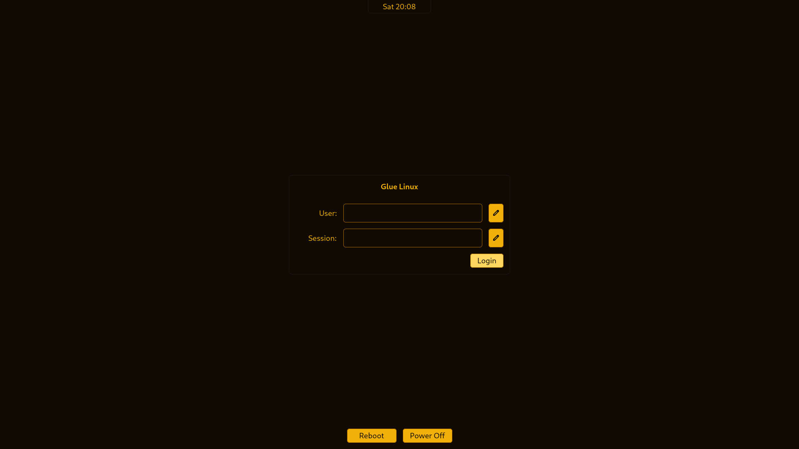

# Glue Linux

A small, amber-themed Linux distribution.

- **Base:** Arch-based, **no systemd** — pick **dinit**, **runit** or **OpenRC**
  at install time
- **Kernel:** `linux-cachyos` (CachyOS performance kernel, EEVDF scheduler, default) or `linux-zen`
- **Installer:** a full-screen **Python curses TUI** (`glue-install`) —
  catalog-driven wizard with Back navigation on every screen, automatic GeoIP
  timezone detection, network clock sync, and GPU driver auto-detection
- **Sessions (pick one or more, or minimal):** **gluewc** with glueqs or
  Noctalia (default), **nvwm**, **KDE Plasma**, **XFCE**, **GNOME** and
  **Cinnamon**
- **Glue Apps:** the single application store. It searches
  the system repositories, Flathub and AUR through `yay` in one window;
  Shelly, Discover and PackageKit are not installed by default.
- **Gaming Mode (optional):** Steam (+ Proton GE preinstalled), Heroic, Vulkan
  32/64-bit, GameMode, MangoHud, Gamescope, `prime-run` for hybrid NVIDIA
  (also Lutris, Faugus, Wine, a sched_ext scheduler via `scx_lavd`, and
  ananicy-cpp process priorities; do not wrap a game in `gamemoderun` and
  expect ananicy to manage it too, pick one)
  laptops, and a persistent NVIDIA shader cache
- **Laptop tuning (auto-detected):** `thermald` on Intel CPUs (RAPL thermal
  management before hard throttling); `power-profiles-daemon` always enabled
  on laptops — the `performance` profile raises the firmware fan curve via
  `platform_profile`; `amd_pstate=active` on AMD Zen2+ (CPPC flag); sensors
  auto-detected at first boot via `sensors-detect --auto`; NVIDIA dGPU runtime
  D3 suspend (`NVreg_DynamicPowerManagement=0x02`) on Optimus laptops so the
  GPU stays off between games. Firmware controls the fans — Glue does not
  install nbfc/fancontrol.
- **Theme:** amber on near-black for TTY, `st`, the Limine boot menu and the installer; the
  graphical login uses a clean light theme with a blue accent

Palette: background `#100A02`, secondary/lines `#A66900`, primary text `#F1B00A`.

## What the installer does

`glue-install` auto-starts on the live ISO (tty1) and walks you through:

1. **network** — required for every install; wired or Wi-Fi via `nmtui` (press
   `N`). As soon as you're online the installer detects your **local timezone**
   and syncs the live clock from the network before it ever touches the RTC
2. **mode** — custom install or **minimal** (bootable base only)
3. **kernel** — `linux-cachyos` (recommended) or `linux-zen`
4. **init system** — `dinit` (recommended), `runit` or `OpenRC`; every service
   is installed with the matching `-dinit`/`-runit`/`-openrc` script package
5. **sessions** — multi-select from the 6 WMs/DEs, each with ease/lightness
   ratings, keybinding cheat-sheet and screenshot path; gluewc offers glueqs
   or Noctalia as its shell
6. **support toggles** — the Glue Apps store backends (repository + Flathub +
   AUR, enabled by default) and Bluetooth (BlueZ + Blueman)
7. **Gaming Mode** — the full Steam stack; the right Vulkan driver
   (NVIDIA open module / RADV / Intel ANV, 32-bit included) is pinned from the
   detected GPU instead of pacman's alphabetical default
8. **storage** — **erase a whole disk** (guided GPT, UEFI or BIOS), **install
   into an existing partition** (only that partition is formatted, the ESP is
   reused — dual-boot friendly), or **manual** via `cfdisk`
9. **identity** — hostname, user, password, locale, timezone (prefilled with
   the detected one)
10. a final summary — nothing is written until you type `yes`

The install itself is a single progress bar (full log in
`/tmp/glue-install.log`). Every install gets: a complete systemd-free base,
NetworkManager, `openntpd` (clock stays right from first boot), sudo wheel
setup, and **Limine** as the bootloader: the EFI partition is mounted at
`/boot` (kernels live on it), `BOOTX64.EFI` goes to `EFI/BOOT` and
`EFI/limine` with an `efibootmgr` entry named "Glue Linux" (BIOS machines get
`limine bios-install`), and `/boot/limine.conf` is generated with an amber
menu, a 5 s timeout, the Glue entry plus a fallback-initramfs entry, a quiet
cmdline (`nowatchdog zswap.enabled=0`, `amd_pstate=active` where detected) and
`resume=` when hibernation got its own swap partition. Automatic entries for
the other OSes on the machine arrive with roadmap 3.4; the live ISO itself
still boots with artools' GRUB until 3.7. Desktop installs add **ReGreet under Cage** on a
dedicated VT7, with Tuigreet selected automatically on machines without KMS,
plus the PipeWire stack and `power-profiles-daemon`
(performance/balanced/power-saver in KDE/GNOME settings, `powerprofilesctl`
elsewhere), fonts, portals, and per-session wrappers that bring up D-Bus +
audio (+ `startx` for the X11 WMs). On NVIDIA machines the installer also
writes `/usr/local/bin/prime-run` (no `nvidia-prime` package needed) — set a
Steam game's launch options to `prime-run %command%` to run it on the dGPU.

Glue Apps and Glue Welcome stay installed when the store
toggle is disabled. With the default enabled, it adds Flatpak, Flathub,
AppStream metadata, `yay` and update checks. AUR recipes are community-made;
Glue Apps asks once before the first AUR installation, and recipes that require
systemd may not work on Glue Linux.

### Glue Apps and Glue Welcome

**[Glue Apps](https://github.com/vladbiber/glue-apps)** is the app store, kept in
its own repository because it also runs on plain Arch, CachyOS and Artix. It
searches Pacman, Flathub and the AUR at once, shows every source on each app page,
installs AppImages, and updates the whole system with one button.

**Glue Welcome** (`packages/glue-welcome`) opens at login and on Super+Shift+F1. It
shows the shortcuts of the window manager you are running (open apps and close a
window first), has a button that updates the whole system through Glue Apps, and
holds the System and Settings pages. Both windows share the look chosen in
Settings. English by default, Romanian in Settings → Language.

```sh
git clone https://github.com/vladbiber/glue-apps.git ../glue-apps
sh scripts/run-glue-welcome-dev.sh
```

## Terminal

Every graphical session ships with **alacritty**, configured by Glue Linux
(Liberation Mono 11, translucent background). Ctrl+Shift +/− changes the font size
persistently and Ctrl+Shift+Backspace resets it. The same works from a terminal:
`termfont +1`, `termfont -2`, `termfont 12`, `termfont reset`.

## Layout

```
glue-linux/
├── build.sh                 # build the ISO on any Docker host
├── Dockerfile               # build env (Arch-based + artools + CachyOS)
├── scripts/make-iso.sh      # runs inside the container: repo + buildiso
├── repo/pacman.conf         # base + lib32 + CachyOS + [glue] repos
├── packages/                # custom packages (built into the [glue] repo)
│   ├── gluewc/              # default Wayland compositor
│   ├── glueqs/              # default gluewc shell/bar
│   ├── nvwm/                # BSP tiling WM, built-in bar, media keys enabled,
│   │                        #   user config at ~/.config/nvwm/config.conf
│   ├── st-glue/         # st patched to the Glue palette + JetBrains Mono
│   ├── proton-ge-custom-bin/# GE-Proton for Steam, preinstalled system-wide
│   ├── glue-installer/  # the Python curses installer + catalog
│   ├── glue-apps/       # PKGBUILD for the store (source: github.com/vladbiber/glue-apps)
│   ├── glue-welcome/    # welcome window: shortcuts, system, settings
│   └── glue-branding/   # amber TTY palette, /etc/issue, os-release, live GRUB theme
└── iso-profile/glue/    # artools profile (package lists + live overlay)
```

## The installer, under the hood

`packages/glue-installer/` is a small Python package with strictly pure
logic layers — `catalog.py` (JSON catalog + validation) → `plan.py` (selection
→ package/service/file plan) → `executor.py` (plan → ordered steps) →
`disks.py` / `limine.py` / `identity.py` / `gpu.py` — driven by a curses
TUI (`ui_model.py` state machine, `render.py`, `tui.py`). All I/O is injected,
so the installer and Glue Welcome are covered by **675+ unit tests that run without root**:

```sh
sh scripts/gate.sh
```

Adding a session/kernel/shell is a catalog edit (`catalog/catalog.json`), not
a code change.

## Get the ISO

**Pick ONE of the two options below — you don't need both.**

- **Just want to run it?** → Option A (download).
- **Want to build it from source / change something?** → Option B (build).

### Option A — Download a prebuilt ISO (easiest)

The ISO is hosted on the Internet Archive (it is over GitHub's 2 GiB
per-file release limit):

- **Direct download:**
  [glue-runit-20260722-x86_64.iso](https://archive.org/download/glue-linux/glue-runit-20260722-x86_64.iso)
- Item page (with torrent): <https://archive.org/details/glue-linux>

Verify it:

```sh
sha256sum glue-runit-20260722-x86_64.iso
# a93c8d7acdfaf512e2df4c80a9b2105f7798295d387c5b0f0667491aa5d961e4
```

Then jump to [Putting the ISO on a USB stick](#putting-the-iso-on-a-usb-stick).
No build needed. Release notes and checksums also live on the
[Releases page](https://github.com/Vifuddyxg/glue-linux/releases).

### Option B — Build it yourself

Only needed if you want to compile the ISO from source. You need **Docker**
(the build runs in a container, so it works from any distro — including a
Gentoo host). The image needs `--privileged` for loop devices / squashfs;
`build.sh` handles that.

```sh
git clone https://github.com/Vifuddyxg/glue-linux.git
cd glue-linux
./build.sh
```

The whole thing is self-contained: `build.sh` spins up the build container,
builds the custom `[glue]` packages via `scripts/make-iso.sh`, and runs
`buildiso` against `iso-profile/glue/`. The custom window managers are cloned
from GitHub during the build. First run downloads packages and takes a while;
re-runs reuse the `.pkgcache/` so they are much faster.

The finished ISO lands in **`./out/`** (≈2.1 GB).

## Putting the ISO on a USB stick

**Ventoy** (recommended — just copy the file):

```sh
cp out/glue-runit-*-x86_64.iso /run/media/<you>/Ventoy/
sync          # IMPORTANT: wait for this to finish before unplugging
```

Or write the whole stick with `dd` (erases it):

```sh
sudo dd if=out/glue-runit-*-x86_64.iso of=/dev/sdX bs=4M status=progress oflag=sync
```

Test it without hardware first:

```sh
qemu-system-x86_64 -enable-kvm -m 4G -bios /usr/share/edk2-ovmf/OVMF_CODE.fd \
    -cdrom out/glue-runit-*-x86_64.iso
```

On the live system you can preview gluewc with glueqs or Noctalia before
installing.

## Status / notes

- The current catalog contains six sessions: gluewc, nvwm, KDE Plasma, XFCE,
  GNOME and Cinnamon. Multiple sessions may be installed together and chosen
  at login.
- The installer is **online-only**: it always `basestrap`s a fresh system, so
  it can fit the CachyOS kernel and your chosen options. The network screen
  hard-blocks until you're connected.
- The live ISO itself runs runit (independent of the target's init) and
  auto-logs into the installer on tty1; every other tty is a normal shell.
- GNOME needs `gnome-session-sysvinit` (the init-agnostic session worker) —
  the catalog includes it, and the GNOME session coexists cleanly with a
  parallel KDE install (no gdm; greetd stays the greeter).
- `iso-profile/glue/profile.yaml` follows the current `artools` iso-profiles
  (YAML) format. **artools changes these keys between versions** — if `buildiso`
  rejects a key, diff against the official `base` profile that `make-iso.sh`
  clones into place and adjust.

## The window managers

- **gluewc** — the default Wayland compositor, paired with glueqs or Noctalia.
- **nvwm** — minimalist X11 tiling with a plain-text configuration and st-glue
  as its small terminal fallback.

Session wrappers start D-Bus and PipeWire and expose every installed session
through the login screen.

The login screen uses a clean light palette, a solid background and a simple
white card. It remembers the last user and session; every desktop selected in
the installer is available from its session chooser.


